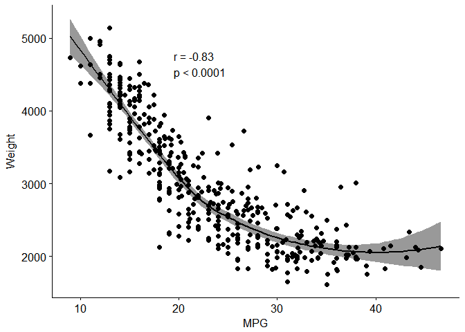
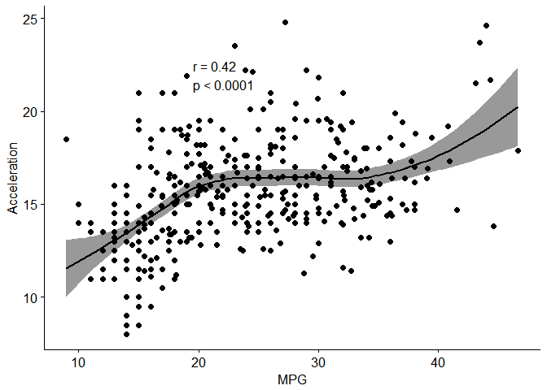
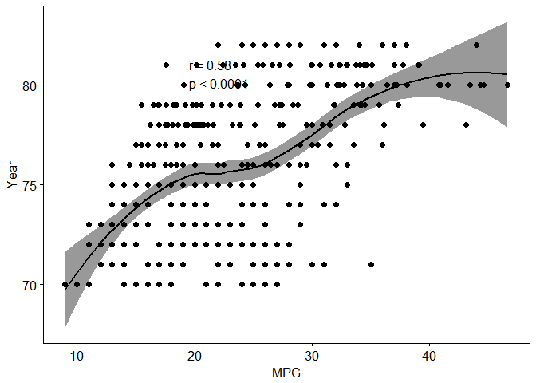
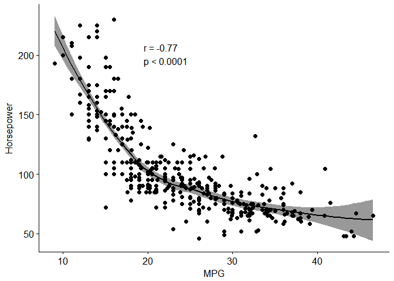
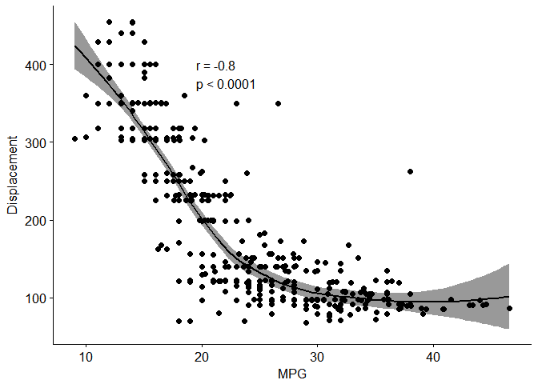
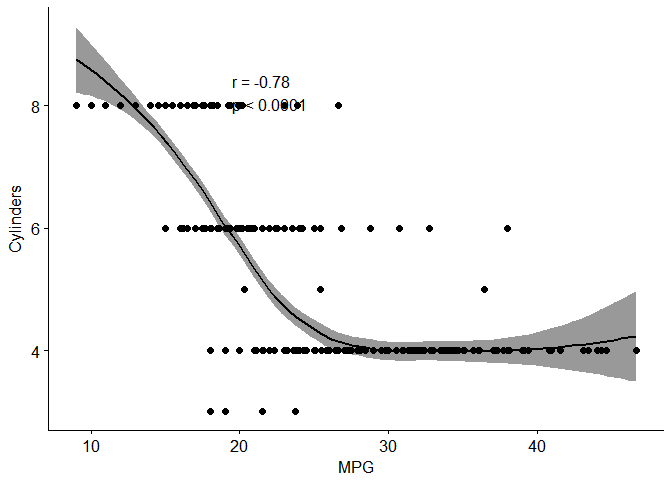

Junior Data Analyst Data Test
-----------------------------

### Karl Hettinger

### Conceptual Questions

> 1.  A data set contains data for 350 manufacturing companies in Europe. The following variables are included in the data for each company: industry, number of employees, salary of the CEO, and total profit. We are interested in learning which variables impact the CEO's salary.

-   The CEO's salary is a continuous variable, so you're looking at a regression model. The goal is to learn how the different data fields affect the salary, not to predict it, so it would be an inference model. There are 350 entries in the data set, and the predictors are the industy, number of employees, and total profits of the company.

> 1.  A market research company is hired to help a start-up analyze their new product. We want to know whether the product will be a success or failure. Similar products exist on the market so the market research company gathers data on 31 similar products. The company records the following data points about each previously launched product: price of the product, competition price, marketing budget, ten other variables, and whether or not it succeeded or failed.

-   You're trying to decide how the different data fields work together to answer a binary question, so this would be a classification model. Because you want to use this model to make decisions about future products, it would be a Prediction model. There are 31 entries in the data set, and the predictors are the price of the product, competition price, marketing budget, and the ten other variables(presumeably).

> 1.  Every week data is collected for the world stock market in 2012. The data points collected include the % change in the dollar, the % change in the market in the United States, the % change in the market in China, and the % change in the market in France. We are interested in predicting the % change in the dollar in relation to the changes every week in the world stock markets.

-   The changing value of the dollar is a continuous variable, so you're looking at a regression model. The goal is to predict how the value of the dollar will change given the value of other markets, so it would be a prediction model. Since the data is collected weekly, there should be 52 entries in the data, and the predictors are the percent change in the three markets: United States, China, and France.

### Applied Questions

-   First, obtain the data:

``` r
if(!"Cars_mileage.csv" %in% dir())
    download.file("https://raw.githubusercontent.com/eneedham/data-analyst-data-test/master/Cars_mileage.csv",
                  "Cars_mileage.csv")
data <- read.csv("Cars_mileage.csv")
```

> 1.  Create a binary variable that represents whether the car's mpg is above or below the dataset's median. Above the median should be represented as 1. Name this variable mpg\_binary.

``` r
median_mpg <- median(data$mpg, na.rm=TRUE)
data$mpg_binary <- ifelse(data$mpg >= median_mpg,1,0)
```

> 1.  Which of the other variables seem most likely to be useful in predicting whether a car's mpg is above or below its median? Describe your findings and submit visual representations of the relationship between mpg\_binary and other variables.

-   The Horsepower field has some non-numeric entries, so replace them with the average horsepower value while un-factoring the column. There are relatively few such values, so inputting the average shouldn't affect the results significantly.

``` r
#This is intended to coerce NAa into the horsepower column
suppressWarnings(data$horsepower <- as.numeric(levels(data$horsepower))[data$horsepower]) 
data$horsepower[is.na(data$horsepower)] <-  mean(data$horsepower,na.rm=TRUE)
```

-   Load the plotting libraries, and make scatter plots with regression lines.

``` r
library(ggplot2)
library(ggpubr)
```

``` r
ggscatter(data, x = "mpg", y = "weight", add = "loess", conf.int = TRUE, cor.coef = TRUE, 
          cor.method = "pearson", xlab = "MPG", ylab = "Weight")
```



``` r
ggscatter(data, x = "mpg", y = "acceleration", add = "loess", conf.int = TRUE, cor.coef = TRUE, 
          cor.method = "pearson", xlab = "MPG", ylab = "Acceleration")
```



``` r
ggscatter(data, x = "mpg", y = "year", add = "loess", conf.int = TRUE, cor.coef = TRUE, 
          cor.method = "pearson", xlab = "MPG", ylab = "Year")
```



``` r
ggscatter(data, x = "mpg", y = "horsepower", add = "loess", conf.int = TRUE, cor.coef = TRUE, 
          cor.method = "pearson", xlab = "MPG", ylab = "Horsepower")
```



``` r
ggscatter(data, x = "mpg", y = "displacement", add = "loess", conf.int = TRUE, cor.coef = TRUE, 
          cor.method = "pearson", xlab = "MPG", ylab = "Displacement")
```



``` r
ggscatter(data, x = "mpg", y = "cylinders", add = "loess", conf.int = TRUE, cor.coef = TRUE, 
          cor.method = "pearson", xlab = "MPG", ylab = "Cylinders")
```



-   Based on the regression plots, Weight and Displacement have strong correlation values (greater than .8) so they would likely be the best predictors. With Horsepower and Cylinders not being too far behind (both at .78), they could also be useful. Acceleration and year appear way too scattered to be of much use.

> 1.  Split the data into a training set and a test set.

-   Since we're using the median as our break-point, roughly half of the data will be above and below, so it seems safe to take a random sampling of the data. I chose to use 75% of the data to train, leaving the remaining 25% to test. Also, only take the columns that we'll be using.

``` r
sample_size <- floor(0.75 * nrow(data))
set.seed(1234)
training_rows <- sample(seq_len(nrow(data)),size = sample_size)
d.train <- data[training_rows,c(2:7,10)]
d.test <- data[-training_rows,c(2:7,10)]
```

> 1.  Perform two of the following in order to predict mpg\_binary

#### K-nearest neighbors

Load the class library for the knn function.

``` r
library(class)
```

Trying each predictor individually

-   Cylinders:

``` r
prediction <- knn(train=data.frame(d.train$cylinders), 
                  test=data.frame(d.test$cylinders), 
                  cl=d.train$mpg_binary, k=5)
mean(prediction == d.test$mpg_binary)
```

    ## [1] 0.94

-   Displacement:

``` r
prediction <- knn(train=data.frame(d.train$displacement), 
                  test=data.frame(d.test$displacement), 
                  cl=d.train$mpg_binary, k=5)
mean(prediction == d.test$mpg_binary)
```

    ## [1] 0.94

-   Horsepower:

``` r
prediction <- knn(train=data.frame(d.train$horsepower), 
                  test=data.frame(d.test$horsepower), 
                  cl=d.train$mpg_binary, k=5)
mean(prediction == d.test$mpg_binary)
```

    ## [1] 0.79

-   Weight:

``` r
prediction <- knn(train=data.frame(d.train$weight), 
                  test=data.frame(d.test$weight), 
                  cl=d.train$mpg_binary, k=5)
mean(prediction == d.test$mpg_binary)
```

    ## [1] 0.91

-   Acceleration:

``` r
prediction <- knn(train=data.frame(d.train$acceleration), 
                  test=data.frame(d.test$acceleration), 
                  cl=d.train$mpg_binary, k=5)
mean(prediction == d.test$mpg_binary)
```

    ## [1] 0.6

-   Year:

``` r
prediction <- knn(train=data.frame(d.train$year), 
                  test=data.frame(d.test$year), 
                  cl=d.train$mpg_binary, k=5)
mean(prediction == d.test$mpg_binary)
```

    ## [1] 0.69

-   And Collectively:

``` r
prediction <- knn(train = data.frame(d.train[,1:6]), 
                  test = data.frame(d.test[,1:6]), 
                  cl=d.train[,7],k=5)
mean(prediction == d.test[,"mpg_binary"])
```

    ## [1] 0.95

-   With this random sampling, the best predictors were Cylinders and Displacement at 94% with Weight close behind at 91%, and, as expected, the Acceleration and Year fields are rather poor. Colectively they perform quite well at 95%. Re-running the code with differnt seeds almost always had Cylinders being the best predictor, and when it wasn't it was a very close second.
    <br> <br>

#### Logistic Regression

-   The test and train data sets have already been made and cleaned, so just need to feed it into the glm function specifying a binary logistic regression.

``` r
model <- glm(mpg_binary ~ ., family=binomial(logit), data=d.train)
summary(model)
```

    ## 
    ## Call:
    ## glm(formula = mpg_binary ~ ., family = binomial(logit), data = d.train)
    ## 
    ## Deviance Residuals: 
    ##      Min        1Q    Median        3Q       Max  
    ## -2.15960  -0.14660   0.04696   0.28018   3.13968  
    ## 
    ## Coefficients:
    ##                Estimate Std. Error z value Pr(>|z|)    
    ## (Intercept)  -16.562286   6.521717  -2.540  0.01110 *  
    ## cylinders      0.046584   0.440365   0.106  0.91575    
    ## displacement  -0.008372   0.010625  -0.788  0.43073    
    ## horsepower    -0.039731   0.024712  -1.608  0.10788    
    ## weight        -0.003362   0.001147  -2.931  0.00338 ** 
    ## acceleration  -0.037940   0.154635  -0.245  0.80618    
    ## year           0.416895   0.082446   5.057 4.27e-07 ***
    ## ---
    ## Signif. codes:  0 '***' 0.001 '**' 0.01 '*' 0.05 '.' 0.1 ' ' 1
    ## 
    ## (Dispersion parameter for binomial family taken to be 1)
    ## 
    ##     Null deviance: 411.46  on 296  degrees of freedom
    ## Residual deviance: 135.30  on 290  degrees of freedom
    ## AIC: 149.3
    ## 
    ## Number of Fisher Scoring iterations: 7

-   With this model, becuase of low p-values, it seems that the best predictors are Year followed by Weight.

-   Now to test the model:

``` r
test.results <- predict(model,newdata=subset(d.test,select=1:6),type='response')
test.results <- ifelse(test.results > 0.5,1,0)
mean(test.results == d.test$mpg_binary)
```

    ## [1] 0.94

-   Ths Logistic Regression model performed with an 94% accuracy on this sampling of the data. While testing out different seeds to get a variety of splits of the data, the lowest performance observed with this model was 84%, with most cases being in the mid 90's.
